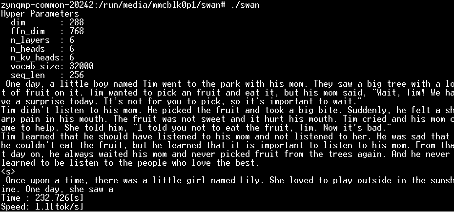

# High-Level Synthesis Based Acceleration of LLaMA2 Inference on FPGA

使用開源的 llama2.c 作為語言模型的程式基礎，目標利用 FPGA 加速語言模型的推論階段，將模型中計算量比較大的部分，像是矩陣乘法，利用 HLS 快速將 C/C++ 程式轉換為硬體描述，再卸載到 ZCU106  開發版上的 FPGA 部分執行，來加速基於 TinyStories 訓練的輕量級語言模型。

# 2025/03/26

## Llama2.c

### Architecture


### Clone and Build

1. Clone the repository

   ```
   $ git clone https://github.com/karpathy/llama2.c.git
   ```
2. Build the project for windows

   ```
   $ cd llama2.c
   $ make win64
   ```

### Download and Run Model

1. Run the stories15M.bin model

   ```
   $ wget https://huggingface.co/karpathy/tinyllamas/resolve/main/stories15M.bin
   $ run stories15M.bin
   ```

   > Once upon a time, there was a boy named Timmy. Timmy loved to play with his toy cars and trucks. One day, Timmy's dad took him to the park to play. Timmy was excited to ride his motorboat in the park.
   > As Timmy was playing, he saw a girl crying. "What's wrong?" Timmy asked. The girl said she lost her favorite toy. Timmy wanted to help her, so he took his motor car and told her to follow him.
   > Timmy ran to the girl and picked up the motor car. He gave it to her and said, "Here you go! I found your toy car!" The girl was so happy and thanked Timmy. She said, "You're so sweet, Timmy. Thank you!"
   > From that day on, Timmy and the girl became best friends. They would ride in their motorboat together and have lots of fun. Timmy was happy that he could make the girl smile with his gift.
   >

   - achieved tok/s: 162.946429
2. Run the stories15Mq.bin model

   ```
   $ wget https://huggingface.co/karpathy/tinyllamas/resolve/main/stories15M.pt
   $ python export.py stories15Mq.bin --version 2 --checkpoint stories15M.pt
   $ runq stories15Mq.bin
   ```

   > One day, a little boy named Tim found a toy rocket. It was red and shiny. He was very happy. Tim wanted to show his friend, Sam. So, he took the toy rocket to the park.
   > At the park, Tim saw Sam and said, "Look, Sam! I have a toy rocket!" Sam was jealous because he did not have a rocket. But then, Sam said, "Wow! I want a rocket too!"
   > Sam found a real rocket in his toy box. He was excited. Tim and Sam played with the real rocket all day. They pretended to go to far away places. They had a lot of fun. They were not jealous anymore. They were happy friends.
   >

   - achieved tok/s: 190.758294
3. Run the stories42M.bin model with specific parameters

   ```
   $ wget https://huggingface.co/karpathy/tinyllamas/resolve/main/stories42M.bin
   $ run stories42M.bin -t 0.8 -n 256 -i "One day, Lily met a Shoggoth"
   ```

   > One day, Lily met a Shoggoth. He was very unique and he had a special power. He could make things vanish!
   > Lily was so excited to see the Shoggoth. She asked, "What can you do?"
   > The Shoggle replied, "I can make things vanish. I can make things appear or go away."
   > Lily was so amazed. She asked, "Can you show me?"
   > The Shoggoth waved his hand and said some magic words. Suddenly, a small toy car appeared! Lily was so excited. She thanked the Shoggor and said goodbye.
   > Lily loved her new unique Shogggin. She would never forget the amazing thing he had done.
   >

   - achieved tok/s: 73.256840

### Reference

- [Llama2.c GitHub Repository](https://github.com/karpathy/llama2.c/)

## HLSTransform

### AWS EC2 F1 Instance

1. Launch instance

   - Go to EC2 → Launch Instance
   - Select FPGA Developer AMI (Amazon Linux 2)
     - $0.796/Hr hosted on `c4.4xlarge`
   - Select z1d.2xlarge
     - starting at $0.744/Hr
   - Create a new key pair (`.pem` format)
   - Allow SSH traffic from My IP
2. Connect to instance

   ```
   $ chmod 400 KeyPair.pem
   $ ssh -i KeyPair.pem ec2-user@<my-instance-public-ip>
   ```

**Note:** Free tier eligible is not supported, so this setup will not be used for now.

### Reference

- [HLSTransform GitHub Repository](https://github.com/HLSTransform/submission/)

## SWAN

### Architecture


- use HLS to offload these six functions to FPGA:
  - Matmul - Matrix-vector multiplication
  - RMSNorm - Normalization
  - SoftMax
  - Add - Vector addition
  - Mul - Vector multiplication
  - RoPE - Positional encoding

### Clone & Download Weight Files

1. Clone the repository

   ```
   $ git clone git@github.com:turingmotors/swan.git
   $ cd swan
   ```
2. Download the model and tokenizer

   ```
   $ mkdir model
   $ wget https://huggingface.co/karpathy/tinyllamas/resolve/main/stories15M.bin -O model/stories15M.bin
   $ wget https://raw.githubusercontent.com/leloykun/llama2.cpp/master/tokenizer.bin -O model/tokenizer.bin
   ```

### Build with CPU Environment

1. Compile the project for windows

   ```
   $ mkdir build && cd build
   $ cmake -G "Ninja" ..
   $ ninja
   ```
2. Run swan

   ```
   $ cd ..
   $ .\build\swan.exe
   ```

   > Once upon a time, there was a little boy named Tim. Tim was a good boy, but he was a bit selfish. He did not like to share his toys with his friends.
   > One day, Tim saw a big box with a picture of a toy on it. He wanted to get the box, but it was too high for him. He asked his friend, Sam, for help. "Sam, can you help me get the box from the box?" Tim said, "No, I want to get the box all by myself!"
   > Sam was sad, but he had an idea. He found a long stick and used it to get the box down for Tim. Tim was very happy and said, "Thank you, Sam! Now we can share the toys and play together." Tim learned that it is better to share and be a good friend, than to be selfish and keep things for himself.
   >

   > One day, a little boy named Tim went to the park. He saw a big tree with a lot of leaves. Tim wanted to play with the leaves, so he started
   > to scatter them around. He laughed and made the leaves fly in the air.
   > As Tim played, he saw a little girl named Sue. She
   >

   - Hyper Parameters
     - dim       : 288
     - ffn_dim   : 768
     - n_layers  : 6
     - n_heads   : 6
     - n_kv_heads: 6
     - vocab_size: 32000
     - seq_len   : 256
   - Time : 18.434[s]
   - Speed: 13.8874[tok/s]

### Build with FPGA Environment

#### Use Kria KV260

- Zynq™ UltraScale+™ MPSoC Structure
- Combination of BRAM (Block RAM) and UltraRAM, approximately 2.7 MB
- DRAM 4 GB

#### Installation

- Vitis (software), Vivado (hardware)
- Vitis HLS (C-to-RTL)
- XRT (Xilinx Runtime Library)
  - let user can use C/C++ to write host code, use XRT to interact with FPGA device.
  - XRT software stack requires Linux kernel 3.10+.

#### Preparing the Development Environment (Follow AMD Official Vitis Tutorials)

1. Generate XSA (in Vivado)
2. Create Vitis Platform
3. Validate this Vitis Platform
4. Run the Application on Hardware
   - Insert the SD card and boot the board with SD boot mode

### Reference

- [SWAN GitHub Repository](https://github.com/turingmotors/swan/)

# 2025/04/09

## VirtualBox Setup

### System Specifications

- Ubuntu 22.04.4 LTS
- Base Memory: 20480 MB
- Processors: 8 CPUs
- Video Memory: 32 MB
- Hard Disk: 200 -> 350 GB
  - Error Solving: Expanding VirtualBox Disk Space
    1. Open Command Prompt as Administrator in Windows:
       ```
       $ cd C:\Program Files\Oracle\VirtualBox
       $ VBoxManage modifyhd "C:\Users\chaoy\VirtualBox VMs\CSP\22044.vdi" -–resize 358400
       ```
    2. In Ubuntu, merge sda4 into sda3:
       ```
       $ sudo lsblk
       $ sudo apt-get install gparted 
       $ sudo gparted
       ```

### Enabling Copy and Paste with Windows

1. If the terminal does not open, try setting the language settings:
   - Settings -> Region & Language
   - Set My Account and Login Screen to United States
2. Go to Devices → Shared Clipboard → Bidirectional.
3. Granting sudo Privileges
   ```
   $ su root
   $ sudo adduser chaoyuan sudo
   $ su chaoyuan
   ```
4. Insert Guest Additions CD
   ```
   $ sudo apt update
   $ sudo apt upgrade
   $ sudo apt install build-essential dkms linux-headers-$(uname -r)
   $ sudo mount /dev/cdrom /mnt
   $ cd /mnt
   $ sudo ./VBoxLinuxAdditions.run
   $ sudo reboot
   ```

## Vivado & Vitis 2024.2 Installation

1. Creating Installation Directory
   ```
   $ cd /
   $ sudo mkdir tools
   $ sudo chmod 777 /tools
   ```
2. Running the Installer
   ```
   $ cd Desktop
   $ ./FPGAs_AdaptiveSoCs_Unified_2024.2_1113_1001_Lin64.bin
   $ cd ..
   $ cd /tools/Xilinx/Vitis/2024.2/scripts
   $ sudo ./installLibs.sh
   ```

   - Error Solving: Fixing Device List Issue
     ```
     $ sudo apt-get update
     $ sudo apt-get upgrade
     $ sudo apt-get install libncurses5
     $ sudo apt-get install libtinfo5
     $ sudo apt-get install libncurses5-dev 
     $ sudo apt-get install libncursesw5-dev
     ```
3. Installing OpenCL Support
   ```
   $ sudo apt-get install ocl-icd-libopencl1
   $ sudo apt-get install opencl-headers
   $ sudo apt-get install ocl-icd-opencl-dev
   ```
4. Installing Other Dependencies
   ```
   $ sudo add-apt-repository ppa:xorg-edgers/ppa
   $ sudo apt-get update
   $ sudo apt-get install libgl1-mesa-glx
   $ sudo apt-get install libgl1-mesa-dri
   $ sudo apt-get install libgl1-mesa-dev
   $ sudo add-apt-repository --remove ppa:xorg-edgers/ppa
   $ sudo apt install net-tools
   $ sudo apt-get install -y unzip
   ```

## PetaLinux 2024.2 Installation

1. Creating Installation Directory
   ```
   $ cd /tools/Xilinx
   $ mkdir petalinux
   $ cd petalinux 
   $ mkdir 2024.2
   ```
2. Installing Required Packages
   ```
   $ sudo apt-get install -y xterm
   $ sudo apt-get install autoconf
   $ sudo apt-get install libtool
   $ sudo apt-get install texinfo
   ```

   - Error Solving: Package has no installation candidate
     1. Edit sources list:
        ```
        $ sudo vim /etc/apt/sources.list: 
        ```
     2. Enter 'i' to add the following lines:
        ```
        $ deb http://archive.ubuntu.com/ubuntu/ jammy main restricted universe multiverse
        $ deb http://archive.ubuntu.com/ubuntu/ jammy-security main restricted universe multiverse
        $ deb http://archive.ubuntu.com/ubuntu/ jammy-updates main restricted universe multiverse
        $ deb http://archive.ubuntu.com/ubuntu/ jammy-proposed main restricted universe multiverse
        $ deb http://archive.ubuntu.com/ubuntu/ jammy-backports main restricted universe multiverse
        ```
     3. Press 'esc and enter ':wq!' to exit
     4. Update packages:
        ```
        $ sudo apt-get update
        ```
3. Disabling Dash
   ```
   $ sudo apt-get install tftpd-hpa
   $ service tftpd-hpa restart
   $ sudo dpkg-reconfigure dash
   ```
4. Running Installer
   ```
   $ bash petalinux-v2024.2-11062026-installer.run -d /tools/Xilinx/petalinux/2024.2
   ```

## ZynqMP Common SDK Installation

```
$ cd xilinx-zynqmp-common-v2024.2
$ ./sdk.sh -y -d ./ -p
```

## Setting Up Environment Variables

1. Show hidden files:
   - Press Ctrl + H in the user directory
2. Edit '.bashrc':
   ```
   $ source /tools/Xilinx/Vivado/2024.2/settings64.sh
   $ source /tools/Xilinx/Vitis/2024.2/settings64.sh
   $ source /tools/Xilinx/petalinux/2024.2/settings.sh
   ```
3. Apply changes:
   ```
   $ source ~/.bashrc
   ```

## Vitis Platform Creation for ZCU106

### Create Hardware Platform using Vivado

1. Create the Base Vivado Project from Preset
2. Customize the System Design for Clock and Reset
3. Add Interrupt Support
   
4. Enable AXI Interfaces for the Platform
5. Export Hardware XSA

### Create Vitis Software Platform

<a href="https://docs.amd.com/viewer/attachment/ANa~eVSCa4x2RWImov0Z_w/OpVNx2NvBV_8CYIfhnItbg-ANa~eVSCa4x2RWImov0Z_w">
    
</a>

1. Prepare the Common Images (privided by PetaLinux / for FPGA boot)
2. Create the Device Tree File (defines hardware components / for Linux to configure system)
   - Error Solving: version `OPENSSL_3.2.0' not found
     ```
     $ export PATH=/usr/bin:$PATH
     $ export LD_LIBRARY_PATH=/usr/lib:$LD_LIBRARY_PATH
     $ xsct
     $ createdts -hw /home/chaoyuan/Desktop/workspace/platform/zcu106_custom_platform/zcu106_custom_platform_hw.xsa -zocl -platform-name zcu106 -git-branch xlnx_rel_v2024.2 -board zcu106-reva -compile -out /home/chaoyuan/Desktop/workspace
     ```
3. Create a Vitis Platform

### Test the Platform using Vector Addition Application

1. Creating Application From Example
2. Set Kernel Image, Root FS, Sysroot
3. Building Hardware (cost ~1 hr)
4. If Build Success, Find "sd_card.img"

### Flash SD-card

1. Download balenaEtcher-Setup-1.18.11.exe
2. The latest version may cause "Error(0,h.requestMetadata) is not a function"
3. Flash "sd-card.img" to SD-Card

### Boot And UART Monitoring

1. Boot ZCU106 Board with SD Card in SD Boot Mode
2. Use UART Serial Monitor in Vitis to Check the Output:
   - Open Vitis -> New Feature Preview -> Serial Monitor Install
   - Connect to the board via UART and monitor the boot log
3. Ensure Correct Baud Rate (e.g. 115200 bps) and COM Port
4. Verify the System Boot Messages and Confirm Successful Execution
   - Error Solving: VFS: Cannot open root device
     1. Press any key during the boot process to enter the U-Boot command line interface
     2. Modify the bootargs
        ```
        $ setenv bootargs "root=/dev/mmcblk0p2"
        $ saveenv
        ```
     3. Restart the system
        ```
        $ boot
        ```

### Run the Application

1. Login with user petalinux and set up a new password

   - Error Solving: Unable to login
     1. Open the SD card in Ubuntu and locate the /etc/ directory under the system partition.
     2. "sudo passwd root" to set a new password for the root account.
     3. "sudo nano /etc/shadow" to check if the password has been set correctly.
     4. The line for the root account should look like this: root:$6$abcd1234$......:15069:0:99999:7:::
2. Go to auto mounted FAT32 partition

   ```
   $ sudo -s
   $ petalinux:/home/petalinux# cd /run/media/mmcblk0p1/
   ```
3. Run vadd application

   ```
   $ ./vadd_host binary_container_1.xclbin
   ```
4. It should show program prints and XRT debug information.

   

### Reference

- [Vitis-Tutorials-Vitis-Platform-Creation](https://docs.amd.com/r/2024.1-English/Vitis-Tutorials-Vitis-Platform-Creation/Customize-the-System-Design-for-Clock-and-Reset)
- [从零开始的Vitis教程](https://www.bilibili.com/video/BV1Fv411q7EK/)
- [從零開始的 Xilinx SoC 開發](https://ys-hayashi.me/2021/08/xilinx-soc-01/)

# 2025/04/16

## Run Swan with ZCU106

### CPU Environment

1. 用 ARM 架構交叉編譯

   1. 安裝 ARM 工具鏈
      ```
      $ sudo apt update
      $ sudo apt install gcc-aarch64-linux-gnu g++-aarch64-linux-gnu
      ```
   2. 建立 ARM 工具鏈檔案
      ```
      # toolchain.cmake
      set(CMAKE_SYSTEM_NAME Linux)
      set(CMAKE_SYSTEM_PROCESSOR aarch64)

      set(CMAKE_C_COMPILER aarch64-linux-gnu-gcc)
      set(CMAKE_CXX_COMPILER aarch64-linux-gnu-g++)
      set(CMAKE_FIND_ROOT_PATH /usr/aarch64-linux-gnu)

      set(CMAKE_FIND_ROOT_PATH_MODE_PROGRAM NEVER)
      set(CMAKE_FIND_ROOT_PATH_MODE_LIBRARY ONLY)
      set(CMAKE_FIND_ROOT_PATH_MODE_INCLUDE ONLY)
      ```
   3. 在 CMakeLists.txt 停用 -mcmodel=large
      ```
      # SET (CMAKE_CXX_FLAGS "-Wall -Wextra -std=c++2a -mcmodel=large")
      SET (CMAKE_CXX_FLAGS "-Wall -Wextra -std=c++2a")
      ```
   4. 使用 ARM 工具鏈進行編譯
      ```
      $ mkdir -p build && cd build
      $ cmake .. -DCMAKE_TOOLCHAIN_FILE=../toolchain.cmake
      $ make
      $ cd ..
      ```
   5. 檢查 ELF Machine
      ```
      $ readelf -h swan
      ```
2. 在 zcu106 執行 swan

   1. 將 swan 和 model 複製到 SD-card
   2. 連接 zcu106 後進入與之前放置 vadd 相同路徑
   3. 執行 swan
      ```
      $ ./swan
      ```

      

   > 可使用 Serial Monitor 或 picocom ($ picocom /dev/ttyUSB0 -b 115200)，按 Ctrl+A、Ctrl+X 退出 picocom
   >

### FPGA Environment

1. 建立 6 個 HLS Component
   1. Name and Location
      - Component name: swan_kernel_add
   2. Configuration File
      - Configuration File: Empty File
   3. Source Files
      - Design Files: select kernel_add.cpp in swan/src
      - Top Function: select kernel_add
   4. Hardware
      - Platform: zcu106
   5. Settings
      - flow_target: Vitis Kernel Flow Target
      - package.output.format: Generate a Vitis XO
2. 建立 Application Component
   1. Name and Location
      - Component name: swan_host
   2. Hardware
      - Platform: zcu106
   3. Sysroot
      - sysroots: select sysroots/cortexa72-cortexa53-xilinx-linux
   4. Source Files
      - Add Sources: select all other files in swan/src
3. 建立 System Project
   1. Name and Location
      - Name: swan
   2. Hardware
      - Platform: zcu106
   3. Embedded Component Paths
      - Kernel Image: select Image
      - Root FS: select rootfs.ext4
      - Sysroot: select sysroots/cortexa72-cortexa53-xilinx-linux
   4. Add Existing Component in Settings/vitis-sys.json
      - swan_host (Application)
      - swan_kernel_add (HLS)
      - swan_kernel_matmul (HLS)
      - swan_kernel_rmsnorm (HLS)
      - swan_kernel_softmax (HLS)
      - swan_kernel_rope (HLS)
      - swan_kernel_mul (HLS)
   5. Build All in HARDWARE (cost ~2.5 hr)
4. 在 zcu106 執行 swan_host
   1. 將 sd-card.img 燒錄至 SD-Card (cost ~0.5 hr)
   2. 將 model 複製到 SD-Card
   3. 將 binary_container_1.xclbin 的副檔名改為 .bin
   4. 執行 swan_host
      ```
      $ ./swan_host
      ```

      

## Run llama2.c / HLSTranform with ZCU106

### CPU Environment

1. 用 ARM 架構交叉編譯
   1. 在 Makefile 加入
      ```
      .PHONY: run_arm
      run_arm:
          aarch64-linux-gnu-gcc -O3 -o run run.c -lm
          aarch64-linux-gnu-gcc -O3 -o runq runq.c -lm
      ```
   2. 編譯 run
      ```
      $ make run_arm
      ```
2. 在 zcu106 執行 run 和 runq
   1. 將 run, runq 和 model 複製到 SD-card
   2. 連接 zcu106 後進入與之前放置 vadd 相同路徑
   3. 執行 run
      ```
      ./run stories15M.bin
      ```

      
   4. 執行 runq
      ```
      ./runq stories15Mq.bin
      ```

      

### FPGA Environment

1. 使用 HLSTransform 的程式碼建立 Component
2. [ERROR] Build Failed: 資源使用量超過目標 FPGA 的上限

## 把 llama2/run.c 遷移到 FPGA 上

*來源: https://github.com/karpathy/llama2.c/blob/master/run.c*

### run.c 生成回覆核心函式: generate()

### generate() 的功能: 根據輸入的 prompt 生成連續文字，流程如下：

1. Encode Prompt: 將輸入的文字 prompt 編碼成對應的 token sequence -> **encode()**
2. main loop 生成文字 (從第一個 token 開始進行語言模型推論)：

   - 每次將目前的 token 輸入 Transformer, 取得 logits -> **forward()**
   - 如果還在處理 prompt 內的 token，則直接使用下一個 prompt token；否則從 logits 中抽樣下一個 token -> **sample()**
   - decode 並印出 token 對應的字詞
3. 計算經過時間，輸出每秒生成的 token 數

p.s. logits 是詞彙被選擇的機率高低

### generate() 的改動: 使用了 XRT (Xilinx Runtime) API 來呼叫 FPGA 上的 kernel 進行推論

1. 打開 device & 載入 kernel

   ```
   auto device = xrt::device(0);
   auto xclbin_uuid = device.load_xclbin(kernelPath);
   auto kernel = xrt::kernel(device, xclbin_uuid, "forward");
   ```
2. 檢查與配置各種 Buffer

   ```
   auto out_buffer = xrt::bo(device, vocab_size * sizeof(float), kernel.group_id(5));
   int cache_dim = n_layers * seq_len * ((dim * n_kv_heads) / n_heads);
   auto transformer_buffer = xrt::bo(device, sizeof(*transformer), kernel.group_id(0));
   auto key_buffer = xrt::bo(device, cache_dim * sizeof(float), kernel.group_id(3));
   auto value_buffer = xrt::bo(device, cache_dim * sizeof(float), kernel.group_id(4));

   transformer_buffer.write(transformer, sizeof(*transformer), 0);
   transformer_buffer.sync(XCL_BO_SYNC_BO_TO_DEVICE);
   ```
3. 執行第一次 kernel execution

   ```
   auto run = kernel(transformer_buffer, token, pos, key_buffer, value_buffer, out_buffer);
   run.wait();

   float *logits = (float *)malloc(vocab_size * sizeof(float));
   out_buffer.sync(XCL_BO_SYNC_BO_FROM_DEVICE);
   out_buffer.read(logits, vocab_size * sizeof(float), 0);
   ```
4. main loop 執行推論，但每次只更新token & pos

   ```
   while (pos < steps) {
       run.set_arg(1, token); // Arguments are specified starting from 0
       run.set_arg(2, pos); 
       run.start();
       run.wait();

       ...
   } 
   ```

### 下面程式碼參考論文 HLTransform

- rmsnorm
- softmax
- matmul

### 以 rmsnorm 的改動為例

#### C Code of Rmsnorm (in llama2/run.c):

```
void rmsnorm(float* o, float* x, float* weight, int size) {
    // calculate sum of squares
    float ss = 0.0f;
    for (int j = 0; j < size; j++) {
        ss += x[j] * x[j];
    }
    ss /= size;
    ss += 1e-5f;
    ss = 1.0f / sqrtf(ss);
    // normalize and scale
    for (int j = 0; j < size; j++) {
        o[j] = weight[j] * (ss * x[j]);
    }
}
```

#### Modified Code for HLS:

**加速重點:**

1. memcpy
   - 另存一份做平行化操作
2. #pragma HLS array_partition variable=NAME type=TYPE factor=INT
   - 指定array怎麼被儲存劃分
   - type: 劃分方式
   - factor: 劃分組數
3. #pragma HLS PIPELINE
4. #pragma HLS UNROLL factor=INT
   - 與 array_partition 搭配使用
5. #pragma HLS loop_tripcount min=INT 0 max=INT avg=INT
   - 設定loop迭代次數的最小值、最大值、平均值

```
template <int S>
void rmsnorm(float o[S], float x[S], float weight[S])
{
  constexpr auto array_size = S * sizeof(float);
  // calculate sum of squares
  float ss = 0.0f;
  float x_buff[S];
  float weight_buff[S];
  float out_buff[S];
#pragma HLS array_partition variable = x_buff type = cyclic factor = 128
#pragma HLS array_partition variable = weight_buff type = cyclic factor = 64
#pragma HLS array_partition variable = out_buff type = cyclic factor = 64
  std::memcpy(x_buff, x, array_size);
  std::memcpy(weight_buff, weight, array_size);

sum_of_squares:
  for (int j = 0; j < S; j++)
  {
#pragma HLS PIPELINE
#pragma HLS UNROLL factor = 128 skip_exit_check
    float x_j = x_buff[j];
    ss += x_j * x_j;
  }
  ss /= S;
  ss += 1e-5f;
  ss = 1.0f / sqrtf(ss);
// normalize and scale
norm_and_scale:
  for (int j = 0; j < S; j++)
  {
#pragma HLS PIPELINE
#pragma HLS UNROLL factor = 64
    float weight_j = weight_buff[j];
    float x_j = x_buff[j];
    out_buff[j] = weight_j * (ss * x_j);
  }
  std::memcpy(o, out_buff, array_size);
}
```

### next steps: 試跑並分析優化效率、做其他 HLS 的優化

# 2025/05/14

## 實驗數據: Token Per Second Performance (with -O3)

| Model Size | APU Only                 | Matmul Kernel (Use pointer) | Modified Kernel (Add BRAM) | Modified Kernel (Pipeline II=1) | Matmul Kernel (No Calc) |
| ---------- | ------------------------ | --------------------------- | -------------------------- | ------------------------------- | ----------------------- |
| 15M        | 11.214840 tok/s (22.83s) | 0.159893 tok/s (1601.07s)   | 3.049744 tok/s (83.94s)    | 5.581464 tok/s (45.87s)         | 9.411678 tok/s (27.20s) |
| 42M        | 4.206484 tok/s           | -                           | 1.139278 tok/s             | 2.150828 tok/s                  | 3.765839 tok/s          |
| 110M       | 1.620548 tok/s           | -                           | 0.441196 tok/s             | 0.855332 tok/s                  | 1.597464 tok/s          |

## 實作方向: 將 forward (所有 kernel) offload 至 FPGA

### 原本

```text
PS: '+' for module; 'o' for loop; '*' for dataflow
+-------------------------------------------------+--------+---------+-----------+----------+---------+----------+------------+-------------+-----+
|                     Modules                     |  Issue | Latency |  Latency  |          |         |          |            |             |     |
|                     & Loops                     |  Type  | (cycles)|    (ns)   | Pipelined|  BRAM   |    DSP   |     FF     |     LUT     | URAM|
+-------------------------------------------------+--------+---------+-----------+----------+---------+----------+------------+-------------+-----+
|+ kernel_forward                                 |  Timing|        -|          -|        no|   9 (1%)|   69 (3%)|  23263 (5%)|  43898 (19%)|    -|
| + kernel_forward_Pipeline_VITIS_LOOP_74_1       |       -|        -|          -|        no|        -|         -|   772 (~0%)|    835 (~0%)|    -|
|  o VITIS_LOOP_74_1                              |       -|        -|          -|       yes|        -|         -|           -|            -|    -|
| o VITIS_LOOP_80_2                               |       -|        -|          -|        no|        -|         -|           -|            -|    -|
|  + rmsnorm_1                                    |  Timing|        -|          -|        no|        -|   5 (~0%)|  1376 (~0%)|    3108 (1%)|    -|
|   + rmsnorm_1_Pipeline_VITIS_LOOP_9_1           |       -|        -|          -|        no|        -|         -|   442 (~0%)|    500 (~0%)|    -|
|    o VITIS_LOOP_9_1                             |      II|        -|          -|       yes|        -|         -|           -|            -|    -|
|   + rmsnorm_1_Pipeline_VITIS_LOOP_18_2          |  Timing|        -|          -|        no|        -|         -|   413 (~0%)|   1777 (~0%)|    -|
|    o VITIS_LOOP_18_2                            |      II|        -|          -|       yes|        -|         -|           -|            -|    -|
|  + matmul_1                                     |       -|        -|          -|        no|        -|   5 (~0%)|  1783 (~0%)|    3064 (1%)|    -|
|   o VITIS_LOOP_50_1                             |       -|        -|          -|        no|        -|         -|           -|            -|    -|
|    + matmul_1_Pipeline_VITIS_LOOP_53_2          |       -|        -|          -|        no|        -|   5 (~0%)|  1026 (~0%)|   1455 (~0%)|    -|
|     o VITIS_LOOP_53_2                           |      II|        -|          -|       yes|        -|         -|           -|            -|    -|
|  + kernel_forward_Pipeline_VITIS_LOOP_164_11    |  Timing|        -|          -|        no|        -|         -|   416 (~0%)|   1672 (~0%)|    -|
|   o VITIS_LOOP_164_11                           |      II|        -|          -|       yes|        -|         -|           -|            -|    -|
|  + kernel_forward_Pipeline_VITIS_LOOP_178_12    |  Timing|        -|          -|        no|        -|         -|   463 (~0%)|   1784 (~0%)|    -|
|   o VITIS_LOOP_178_12                           |      II|        -|          -|       yes|        -|         -|           -|            -|    -|
|  + kernel_forward_Pipeline_VITIS_LOOP_192_13    |  Timing|        -|          -|        no|        -|         -|   416 (~0%)|   1672 (~0%)|    -|
|   o VITIS_LOOP_192_13                           |      II|        -|          -|       yes|        -|         -|           -|            -|    -|
|  o VITIS_LOOP_95_3                              |       -|        -|          -|        no|        -|         -|           -|            -|    -|
|   + pow_generic_float_s                         |       -|        6|     60.000|       yes|  1 (~0%)|   7 (~0%)|   699 (~0%)|    2607 (1%)|    -|
|   + sin_or_cos_float_s                          |       -|       16|    160.000|        no|        -|  13 (~0%)|   719 (~0%)|    2671 (1%)|    -|
|    + sin_or_cos_float_Pipeline_1                |       -|        4|     40.000|        no|        -|         -|    68 (~0%)|    207 (~0%)|    -|
|     o Loop 1                                    |       -|        2|     20.000|       yes|        -|         -|           -|            -|    -|
|    + sin_or_cos_float_Pipeline_2                |       -|        3|     30.000|        no|        -|         -|    65 (~0%)|    458 (~0%)|    -|
|     o Loop 1                                    |       -|        1|     10.000|       yes|        -|         -|           -|            -|    -|
|   + sin_or_cos_float_s                          |       -|       16|    160.000|        no|        -|  13 (~0%)|   719 (~0%)|    2671 (1%)|    -|
|    + sin_or_cos_float_Pipeline_1                |       -|        4|     40.000|        no|        -|         -|    68 (~0%)|    207 (~0%)|    -|
|     o Loop 1                                    |       -|        2|     20.000|       yes|        -|         -|           -|            -|    -|
|    + sin_or_cos_float_Pipeline_2                |       -|        3|     30.000|        no|        -|         -|    65 (~0%)|    458 (~0%)|    -|
|     o Loop 1                                    |       -|        1|     10.000|       yes|        -|         -|           -|            -|    -|
|   + kernel_forward_Pipeline_VITIS_LOOP_102_4    |  Timing|      296|  4.692e+03|        no|        -|   3 (~0%)|   880 (~0%)|   2063 (~0%)|    -|
|    o VITIS_LOOP_102_4                           |      II|      294|  4.660e+03|       yes|        -|         -|           -|            -|    -|
|  o VITIS_LOOP_113_5                             |       -|        -|          -|        no|        -|         -|           -|            -|    -|
|   + kernel_forward_Pipeline_VITIS_LOOP_27_1     |       -|        -|          -|        no|        -|         -|   568 (~0%)|    686 (~0%)|    -|
|    o VITIS_LOOP_27_1                            |       -|        -|          -|       yes|        -|         -|           -|            -|    -|
|   + kernel_forward_Pipeline_VITIS_LOOP_35_2     |  Timing|        -|          -|        no|        -|         -|   355 (~0%)|   1541 (~0%)|    -|
|    o VITIS_LOOP_35_2                            |      II|        -|          -|       yes|        -|         -|           -|            -|    -|
|   + kernel_forward_Pipeline_VITIS_LOOP_41_3     |  Timing|        -|          -|        no|        -|         -|   323 (~0%)|   1496 (~0%)|    -|
|    o VITIS_LOOP_41_3                            |      II|        -|          -|       yes|        -|         -|           -|            -|    -|
|   + kernel_forward_Pipeline_VITIS_LOOP_142_8    |       -|        -|          -|        no|        -|         -|   244 (~0%)|    292 (~0%)|    -|
|    o VITIS_LOOP_142_8                           |       -|        -|          -|       yes|        -|         -|           -|            -|    -|
|   o VITIS_LOOP_119_6                            |       -|        -|          -|        no|        -|         -|           -|            -|    -|
|    + kernel_forward_Pipeline_VITIS_LOOP_126_7   |       -|        -|          -|        no|        -|         -|   671 (~0%)|   1163 (~0%)|    -|
|     o VITIS_LOOP_126_7                          |      II|        -|          -|       yes|        -|         -|           -|            -|    -|
|   o VITIS_LOOP_147_9                            |       -|        -|          -|        no|        -|         -|           -|            -|    -|
|    + kernel_forward_Pipeline_VITIS_LOOP_153_10  |  Timing|        -|          -|        no|        -|         -|   414 (~0%)|   1794 (~0%)|    -|
|     o VITIS_LOOP_153_10                         |      II|        -|          -|       yes|        -|         -|           -|            -|    -|
+-------------------------------------------------+--------+---------+-----------+----------+---------+----------+------------+-------------+-----+
```

### 修改程式碼: 減少 Issue

```text
PS: '+' for module; 'o' for loop; '*' for dataflow
+------------------------------------------------+------+---------+--------+----------+----------+---------+------------+-------------+-----+
|                     Modules                    | Issue| Latency | Latency|          |          |         |            |             |     |
|                     & Loops                    | Type | (cycles)|  (ns)  | Pipelined|   BRAM   |   DSP   |     FF     |     LUT     | URAM|
+------------------------------------------------+------+---------+--------+----------+----------+---------+------------+-------------+-----+
|+ kernel_forward                                |     -|        -|       -|        no|  68 (10%)|  70 (4%)|  33939 (7%)|  39922 (17%)|    -|
| + kernel_forward_Pipeline_token_embedding      |     -|        -|       -|        no|         -|        -|   772 (~0%)|    835 (~0%)|    -|
|  o token_embedding                             |     -|        -|       -|       yes|         -|        -|           -|            -|    -|
| o layer                                        |     -|        -|       -|        no|         -|        -|           -|            -|    -|
|  + rmsnorm_1                                   |     -|        -|       -|        no|    8 (1%)|  8 (~0%)|  2765 (~0%)|    3244 (1%)|    -|
|   + rmsnorm_1_Pipeline_read_x                  |     -|        -|       -|        no|         -|        -|   508 (~0%)|    482 (~0%)|    -|
|    o read_x                                    |     -|        -|       -|       yes|         -|        -|           -|            -|    -|
|   + rmsnorm_1_Pipeline_read_w                  |     -|        -|       -|        no|         -|        -|   508 (~0%)|    482 (~0%)|    -|
|    o read_w                                    |     -|        -|       -|       yes|         -|        -|           -|            -|    -|
|   + rmsnorm_1_Pipeline_calculate_ss            |     -|        -|       -|        no|         -|        -|   371 (~0%)|    291 (~0%)|    -|
|    o calculate_ss                              |     -|        -|       -|       yes|         -|        -|           -|            -|    -|
|   + rmsnorm_1_Pipeline_calculate_norm          |     -|        -|       -|        no|         -|  3 (~0%)|   810 (~0%)|    685 (~0%)|    -|
|    o calculate_norm                            |     -|        -|       -|       yes|         -|        -|           -|            -|    -|
|  + matmul_1_1                                  |     -|        -|       -|        no|   4 (~0%)|  5 (~0%)|  2147 (~0%)|    2824 (1%)|    -|
|   + matmul_1_1_Pipeline_read_x                 |     -|        -|       -|        no|         -|        -|   508 (~0%)|    483 (~0%)|    -|
|    o read_x                                    |     -|        -|       -|       yes|         -|        -|           -|            -|    -|
|   o calculate_d                                |     -|        -|       -|        no|         -|        -|           -|            -|    -|
|    + matmul_1_1_Pipeline_calculate_n           |     -|        -|       -|        no|         -|  3 (~0%)|   939 (~0%)|    831 (~0%)|    -|
|     o calculate_n                              |     -|        -|       -|       yes|         -|        -|           -|            -|    -|
|  + kernel_forward_Pipeline_read_cos            |     -|        -|       -|        no|         -|        -|   144 (~0%)|    250 (~0%)|    -|
|   o read_cos                                   |     -|        -|       -|       yes|         -|        -|           -|            -|    -|
|  + kernel_forward_Pipeline_read_sin            |     -|        -|       -|        no|         -|        -|   144 (~0%)|    250 (~0%)|    -|
|   o read_sin                                   |     -|        -|       -|       yes|         -|        -|           -|            -|    -|
|  + kernel_forward_Pipeline_read_sq             |     -|        -|       -|        no|         -|        -|   508 (~0%)|    482 (~0%)|    -|
|   o read_sq                                    |     -|        -|       -|       yes|         -|        -|           -|            -|    -|
|  + kernel_forward_Pipeline_read_sk             |     -|        -|       -|        no|         -|        -|   508 (~0%)|    482 (~0%)|    -|
|   o read_sk                                    |     -|        -|       -|       yes|         -|        -|           -|            -|    -|
|  + kernel_forward_Pipeline_RoPE                |     -|        -|       -|        no|         -|  22 (1%)|  2548 (~0%)|   1925 (~0%)|    -|
|   o RoPE                                       |     -|        -|       -|       yes|         -|        -|           -|            -|    -|
|  + kernel_forward_Pipeline_write_sq            |     -|        -|       -|        no|         -|        -|   310 (~0%)|    433 (~0%)|    -|
|   o write_sq                                   |     -|        -|       -|       yes|         -|        -|           -|            -|    -|
|  + kernel_forward_Pipeline_write_sk            |     -|        -|       -|        no|         -|        -|   310 (~0%)|    433 (~0%)|    -|
|   o write_sk                                   |     -|        -|       -|       yes|         -|        -|           -|            -|    -|
|  + kernel_forward_Pipeline_read_x_attention    |     -|        -|       -|        no|         -|        -|   508 (~0%)|    482 (~0%)|    -|
|   o read_x_attention                           |     -|        -|       -|       yes|         -|        -|           -|            -|    -|
|  + kernel_forward_Pipeline_residual_attention  |     -|        -|       -|        no|         -|        -|   898 (~0%)|    630 (~0%)|    -|
|   o residual_attention                         |     -|        -|       -|       yes|         -|        -|           -|            -|    -|
|  + kernel_forward_Pipeline_write_x_attention   |     -|        -|       -|        no|         -|        -|   310 (~0%)|    433 (~0%)|    -|
|   o write_x_attention                          |     -|        -|       -|       yes|         -|        -|           -|            -|    -|
|  + kernel_forward_Pipeline_read_shb            |     -|        -|       -|        no|         -|        -|   509 (~0%)|    482 (~0%)|    -|
|   o read_shb                                   |     -|        -|       -|       yes|         -|        -|           -|            -|    -|
|  + kernel_forward_Pipeline_FFN_SwiGLU          |     -|        -|       -|        no|         -|        -|  1093 (~0%)|    664 (~0%)|    -|
|   o FFN_SwiGLU                                 |     -|        -|       -|       yes|         -|        -|           -|            -|    -|
|  + kernel_forward_Pipeline_write_shb           |     -|        -|       -|        no|         -|        -|   310 (~0%)|    433 (~0%)|    -|
|   o write_shb                                  |     -|        -|       -|       yes|         -|        -|           -|            -|    -|
|  + kernel_forward_Pipeline_read_x1             |     -|        -|       -|        no|         -|        -|   509 (~0%)|    482 (~0%)|    -|
|   o read_x                                     |     -|        -|       -|       yes|         -|        -|           -|            -|    -|
|  + kernel_forward_Pipeline_read_x_FFN          |     -|        -|       -|        no|         -|        -|   508 (~0%)|    482 (~0%)|    -|
|   o read_x_FFN                                 |     -|        -|       -|       yes|         -|        -|           -|            -|    -|
|  + kernel_forward_Pipeline_residual_FFN        |     -|        -|       -|        no|         -|        -|   898 (~0%)|    630 (~0%)|    -|
|   o residual_FFN                               |     -|        -|       -|       yes|         -|        -|           -|            -|    -|
|  + kernel_forward_Pipeline_write_x_FFN         |     -|        -|       -|        no|         -|        -|   310 (~0%)|    433 (~0%)|    -|
|   o write_x_FFN                                |     -|        -|       -|       yes|         -|        -|           -|            -|    -|
|  o head                                        |     -|        -|       -|        no|         -|        -|           -|            -|    -|
|   + kernel_forward_Pipeline_read_q             |     -|        -|       -|        no|         -|        -|   505 (~0%)|    540 (~0%)|    -|
|    o read_q                                    |     -|        -|       -|       yes|         -|        -|           -|            -|    -|
|   + kernel_forward_Pipeline_read_x             |     -|        -|       -|        no|         -|        -|   507 (~0%)|    483 (~0%)|    -|
|    o read_x                                    |     -|        -|       -|       yes|         -|        -|           -|            -|    -|
|   + kernel_forward_Pipeline_find_max           |     -|        -|       -|        no|         -|        -|   135 (~0%)|    283 (~0%)|    -|
|    o find_max                                  |     -|        -|       -|       yes|         -|        -|           -|            -|    -|
|   + kernel_forward_Pipeline_calculate_sum      |     -|        -|       -|        no|         -|        -|   701 (~0%)|    419 (~0%)|    -|
|    o calculate_sum                             |     -|        -|       -|       yes|         -|        -|           -|            -|    -|
|   + kernel_forward_Pipeline_calculate_norm     |     -|        -|       -|        no|         -|        -|   464 (~0%)|    294 (~0%)|    -|
|    o calculate_norm                            |     -|        -|       -|       yes|         -|        -|           -|            -|    -|
|   + kernel_forward_Pipeline_write_x            |     -|        -|       -|        no|         -|        -|   310 (~0%)|    433 (~0%)|    -|
|    o write_x                                   |     -|        -|       -|       yes|         -|        -|           -|            -|    -|
|   + kernel_forward_Pipeline_init               |     -|        -|       -|        no|         -|        -|   244 (~0%)|    235 (~0%)|    -|
|    o init                                      |     -|        -|       -|       yes|         -|        -|           -|            -|    -|
|   o time_step                                  |     -|        -|       -|        no|         -|        -|           -|            -|    -|
|    + kernel_forward_Pipeline_head_size         |     -|        -|       -|        no|         -|        -|   808 (~0%)|    684 (~0%)|    -|
|     o head_size                                |     -|        -|       -|       yes|         -|        -|           -|            -|    -|
|   o time_step_sum                              |     -|        -|       -|        no|         -|        -|           -|            -|    -|
|    + kernel_forward_Pipeline_read_xb           |     -|        -|       -|        no|         -|        -|   505 (~0%)|    483 (~0%)|    -|
|     o read_xb                                  |     -|        -|       -|       yes|         -|        -|           -|            -|    -|
|    + kernel_forward_Pipeline_head_size_sum     |     -|        -|       -|        no|         -|        -|   887 (~0%)|    687 (~0%)|    -|
|     o head_size_sum                            |     -|        -|       -|       yes|         -|        -|           -|            -|    -|
|    + kernel_forward_Pipeline_write_xb          |     -|        -|       -|        no|         -|        -|   310 (~0%)|    433 (~0%)|    -|
|     o write_xb                                 |     -|        -|       -|       yes|         -|        -|           -|            -|    -|
|  o calculate_d                                 |     -|        -|       -|        no|         -|        -|           -|            -|    -|
|   + kernel_forward_Pipeline_calculate_n        |     -|        -|       -|        no|         -|        -|   812 (~0%)|    755 (~0%)|    -|
|    o calculate_n                               |     -|        -|       -|       yes|         -|        -|           -|            -|    -|
+------------------------------------------------+------+---------+--------+----------+----------+---------+------------+-------------+-----+
```

### 改進方向

1. 使用 DATAFLOW 等方式繼續優化
2. 增加 BRAM 等資源使用率

## 實驗目的: find an alternative of BRAM

### 原本: 一條用BRAM存，一塊用指標存取

```cpp
#ifndef USE_CPU_ONLY

#include <hls_stream.h>
#include <stdint.h>

// kDim = 288, ffn_dim = 768

template <int VEC_SIZE, int COL_SIZE>
void kernel_matmul_impl(float *i_vec, float *i_mat, float *o_vec, int vec_size, int col_size)
{
    // Local buffers in BRAM
    float vec_local[VEC_SIZE];
    // #pragma HLS ARRAY_PARTITION variable = vec_local type = cyclic factor = 4

    // float mat_local[COL_SIZE][VEC_SIZE];
    // #pragma HLS ARRAY_PARTITION variable = mat_local type = cyclic factor = 2 dim = 2
    // #pragma HLS bind_storage variable = mat_local type = RAM_2P impl = uram

    // const int VEC_SIZE = 288; // const value for unrolling
    // const int COL_SIZE = 288;

// ====================================================================
// Step 1: Load i_vec into local BRAM
load_vec:
    for (int i = 0; i < VEC_SIZE; i++)
    {
#pragma HLS PIPELINE off
//#pragma HLS UNROLL factor = 2
        vec_local[i] = i_vec[i];
    }

    // Step 2: Load i_mat into local BRAM
    // load_mat: // flatten: this is a single continuous index, allowing memory to burst mode read smoothly — AXI happy!
    //     for (int i = 0; i < COL_SIZE * VEC_SIZE; i++)
    //     {
    // #pragma HLS PIPELINE
    // #pragma HLS UNROLL factor = 16
    //         mat_local[i / VEC_SIZE][i % VEC_SIZE] = i_mat[i];
    //     }

    // Step 3: Matrix-Vector Multiplication
    float sum;
compute_matmul:
    for (int i = 0; i < COL_SIZE; i++)
    {
//#pragma HLS UNROLL factor = 4
        sum = 0;
        for (int j = 0; j < VEC_SIZE; j++)
        {
#pragma HLS PIPELINE off
            // URAM does not have two port, does not support unrolling
            // sum += mat_local[i][j] * vec_local[j];
            sum += i_mat[i * vec_size + j] * vec_local[j];
        }
        o_vec[i] = sum;
    }
}

// Top-level non-template wrapper
extern "C"
{
    void kernel_matmul(float *i_vec, float *i_mat, float *o_vec, int vec_size, int col_size)
    {
#pragma HLS INTERFACE m_axi port = i_vec bundle = gmem0 max_read_burst_length = 256
#pragma HLS INTERFACE m_axi port = i_mat bundle = gmem1 max_read_burst_length = 256
#pragma HLS INTERFACE m_axi port = o_vec bundle = gmem0 max_write_burst_length = 256

#pragma HLS INTERFACE s_axilite port = i_vec bundle = control
#pragma HLS INTERFACE s_axilite port = i_mat bundle = control
#pragma HLS INTERFACE s_axilite port = o_vec bundle = control
#pragma HLS INTERFACE s_axilite port = vec_size bundle = control
#pragma HLS INTERFACE s_axilite port = col_size bundle = control
#pragma HLS INTERFACE s_axilite port = return bundle = control

        if (vec_size == 288 && col_size == 288)
            kernel_matmul_impl<288, 288>(i_vec, i_mat, o_vec, vec_size, col_size);
        else if (vec_size == 288 && col_size == 768)
            kernel_matmul_impl<288, 768>(i_vec, i_mat, o_vec, vec_size, col_size);
        else if (vec_size == 768 && col_size == 288)
            kernel_matmul_impl<768, 288>(i_vec, i_mat, o_vec, vec_size, col_size);
    }
}

#endif // USE_CPU_ONLY
```

| Latency (cycles) | Latency (ns) | BRAM      | DSP     | FF          | LUT       | URAM |
| ---------------- | ------------ | --------- | ------- | ----------- | --------- | ---- |
| 2437172          | 2.437e+07    | 261 (41%) | 5 (~0%) | 17,342 (3%) | 9492 (4%) | -    |

### 1: 一條用BRAM存，一塊用BRAM存

```cpp
#ifndef USE_CPU_ONLY

#include <hls_stream.h>
#include <stdint.h>

// kDim = 288, ffn_dim = 768

template <int VEC_SIZE, int COL_SIZE>
void kernel_matmul_impl(float *i_vec, float *i_mat, float *o_vec, int vec_size, int col_size)
{
    // Local buffers in BRAM
    float vec_local[VEC_SIZE];
    // #pragma HLS ARRAY_PARTITION variable = vec_local type = cyclic factor = 4

    float mat_local[COL_SIZE][VEC_SIZE];
    // #pragma HLS ARRAY_PARTITION variable = mat_local type = cyclic factor = 2 dim = 2
    // #pragma HLS bind_storage variable = mat_local type = RAM_2P impl = uram

    // const int VEC_SIZE = 288; // const value for unrolling
    // const int COL_SIZE = 288;

// ====================================================================
// Step 1: Load i_vec into local BRAM
load_vec:
    for (int i = 0; i < VEC_SIZE; i++)
    {
#pragma HLS PIPELINE off
//#pragma HLS UNROLL factor = 2
        vec_local[i] = i_vec[i];
    }

// Step 2: Load i_mat into local BRAM
load_mat: // flatten: this is a single continuous index, allowing memory to burst mode read smoothly — AXI happy!
    for (int i = 0; i < COL_SIZE * VEC_SIZE; i++)
    {
#pragma HLS PIPELINE off
    // #pragma HLS UNROLL factor = 16
    mat_local[i / VEC_SIZE][i % VEC_SIZE] = i_mat[i];
    }

    // Step 3: Matrix-Vector Multiplication
    float sum;
compute_matmul:
    for (int i = 0; i < COL_SIZE; i++)
    {
//#pragma HLS UNROLL factor = 4
        sum = 0;
        for (int j = 0; j < VEC_SIZE; j++)
        {
#pragma HLS PIPELINE off
            // URAM does not have two port, does not support unrolling
            // sum += mat_local[i][j] * vec_local[j];
            sum += mat_local[i][j] * vec_local[j];
        }
        o_vec[i] = sum;
    }
}

// Top-level non-template wrapper
extern "C"
{
    void kernel_matmul(float *i_vec, float *i_mat, float *o_vec, int vec_size, int col_size)
    {
#pragma HLS INTERFACE m_axi port = i_vec bundle = gmem0 max_read_burst_length = 256
#pragma HLS INTERFACE m_axi port = i_mat bundle = gmem1 max_read_burst_length = 256
#pragma HLS INTERFACE m_axi port = o_vec bundle = gmem0 max_write_burst_length = 256

#pragma HLS INTERFACE s_axilite port = i_vec bundle = control
#pragma HLS INTERFACE s_axilite port = i_mat bundle = control
#pragma HLS INTERFACE s_axilite port = o_vec bundle = control
#pragma HLS INTERFACE s_axilite port = vec_size bundle = control
#pragma HLS INTERFACE s_axilite port = col_size bundle = control
#pragma HLS INTERFACE s_axilite port = return bundle = control

        if (vec_size == 288 && col_size == 288)
            kernel_matmul_impl<288, 288>(i_vec, i_mat, o_vec, vec_size, col_size);
        else if (vec_size == 288 && col_size == 768)
            kernel_matmul_impl<288, 768>(i_vec, i_mat, o_vec, vec_size, col_size);
        else if (vec_size == 768 && col_size == 288)
            kernel_matmul_impl<768, 288>(i_vec, i_mat, o_vec, vec_size, col_size);
    }
}

#endif // USE_CPU_ONLY
```

| Latency (cycles) | Latency (ns) | BRAM        | DSP     | FF          | LUT        | URAM |
| ---------------- | ------------ | ----------- | ------- | ----------- | ---------- | ---- |
| 2657594          | 2.658e+07    | 1197 (191%) | 5 (~0%) | 16,158 (3%) | 10341 (4%) | -    |

### 2: 一條用BRAM存，一塊用URAM存

```cpp
#ifndef USE_CPU_ONLY

#include <hls_stream.h>
#include <stdint.h>

// kDim = 288, ffn_dim = 768

template <int VEC_SIZE, int COL_SIZE>
void kernel_matmul_impl(float *i_vec, float *i_mat, float *o_vec, int vec_size, int col_size)
{
    // Local buffers in BRAM
    float vec_local[VEC_SIZE];
    // #pragma HLS ARRAY_PARTITION variable = vec_local type = cyclic factor = 4

    float mat_local[COL_SIZE][VEC_SIZE];
    // #pragma HLS ARRAY_PARTITION variable = mat_local type = cyclic factor = 2 dim = 2
#pragma HLS bind_storage variable = mat_local type = RAM_2P impl = uram

    // const int VEC_SIZE = 288; // const value for unrolling
    // const int COL_SIZE = 288;

// ====================================================================
// Step 1: Load i_vec into local BRAM
load_vec:
    for (int i = 0; i < VEC_SIZE; i++)
    {
#pragma HLS PIPELINE off
//#pragma HLS UNROLL factor = 2
        vec_local[i] = i_vec[i];
    }

// Step 2: Load i_mat into local BRAM
load_mat: // flatten: this is a single continuous index, allowing memory to burst mode read smoothly — AXI happy!
    for (int i = 0; i < COL_SIZE * VEC_SIZE; i++)
    {
#pragma HLS PIPELINE off
    // #pragma HLS UNROLL factor = 16
    mat_local[i / VEC_SIZE][i % VEC_SIZE] = i_mat[i];
    }

    // Step 3: Matrix-Vector Multiplication
    float sum;
compute_matmul:
    for (int i = 0; i < COL_SIZE; i++)
    {
//#pragma HLS UNROLL factor = 4
        sum = 0;
        for (int j = 0; j < VEC_SIZE; j++)
        {
#pragma HLS PIPELINE off
            // URAM does not have two port, does not support unrolling
            // sum += mat_local[i][j] * vec_local[j];
            sum += mat_local[i][j] * vec_local[j];
        }
        o_vec[i] = sum;
    }
}

// Top-level non-template wrapper
extern "C"
{
    void kernel_matmul(float *i_vec, float *i_mat, float *o_vec, int vec_size, int col_size)
    {
#pragma HLS INTERFACE m_axi port = i_vec bundle = gmem0 max_read_burst_length = 256
#pragma HLS INTERFACE m_axi port = i_mat bundle = gmem1 max_read_burst_length = 256
#pragma HLS INTERFACE m_axi port = o_vec bundle = gmem0 max_write_burst_length = 256

#pragma HLS INTERFACE s_axilite port = i_vec bundle = control
#pragma HLS INTERFACE s_axilite port = i_mat bundle = control
#pragma HLS INTERFACE s_axilite port = o_vec bundle = control
#pragma HLS INTERFACE s_axilite port = vec_size bundle = control
#pragma HLS INTERFACE s_axilite port = col_size bundle = control
#pragma HLS INTERFACE s_axilite port = return bundle = control

        if (vec_size == 288 && col_size == 288)
            kernel_matmul_impl<288, 288>(i_vec, i_mat, o_vec, vec_size, col_size);
        else if (vec_size == 288 && col_size == 768)
            kernel_matmul_impl<288, 768>(i_vec, i_mat, o_vec, vec_size, col_size);
        else if (vec_size == 768 && col_size == 288)
            kernel_matmul_impl<768, 288>(i_vec, i_mat, o_vec, vec_size, col_size);
    }
}

#endif // USE_CPU_ONLY
```

| Latency (cycles) | Latency (ns) | BRAM      | DSP     | FF          | LUT        | URAM       |
| ---------------- | ------------ | --------- | ------- | ----------- | ---------- | ---------- |
| 2657594          | 2.658e+07    | 261 (41%) | 5 (~0%) | 16,158 (3%) | 10341 (4%) | 129 (134%) |

### 3: 一條用BRAM存，一塊用LUT RAM存

```cpp
#ifndef USE_CPU_ONLY

#include <hls_stream.h>
#include <stdint.h>

// kDim = 288, ffn_dim = 768

template <int VEC_SIZE, int COL_SIZE>
void kernel_matmul_impl(float *i_vec, float *i_mat, float *o_vec, int vec_size, int col_size)
{
    // Local buffers in BRAM
    float vec_local[VEC_SIZE];
    // #pragma HLS ARRAY_PARTITION variable = vec_local type = cyclic factor = 4

    float mat_local[COL_SIZE][VEC_SIZE];
    // #pragma HLS ARRAY_PARTITION variable = mat_local type = cyclic factor = 2 dim = 2
#pragma HLS bind_storage variable = mat_local type = RAM_1P impl = lutram

    // const int VEC_SIZE = 288; // const value for unrolling
    // const int COL_SIZE = 288;

// ====================================================================
// Step 1: Load i_vec into local BRAM
load_vec:
    for (int i = 0; i < VEC_SIZE; i++)
    {
#pragma HLS PIPELINE off
//#pragma HLS UNROLL factor = 2
        vec_local[i] = i_vec[i];
    }

// Step 2: Load i_mat into local BRAM
load_mat: // flatten: this is a single continuous index, allowing memory to burst mode read smoothly — AXI happy!
    for (int i = 0; i < COL_SIZE * VEC_SIZE; i++)
    {
#pragma HLS PIPELINE off
    // #pragma HLS UNROLL factor = 16
    mat_local[i / VEC_SIZE][i % VEC_SIZE] = i_mat[i];
    }

    // Step 3: Matrix-Vector Multiplication
    float sum;
compute_matmul:
    for (int i = 0; i < COL_SIZE; i++)
    {
//#pragma HLS UNROLL factor = 4
        sum = 0;
        for (int j = 0; j < VEC_SIZE; j++)
        {
#pragma HLS PIPELINE off
            // URAM does not have two port, does not support unrolling
            // sum += mat_local[i][j] * vec_local[j];
            sum += mat_local[i][j] * vec_local[j];
        }
        o_vec[i] = sum;
    }
}

// Top-level non-template wrapper
extern "C"
{
    void kernel_matmul(float *i_vec, float *i_mat, float *o_vec, int vec_size, int col_size)
    {
#pragma HLS INTERFACE m_axi port = i_vec bundle = gmem0 max_read_burst_length = 256
#pragma HLS INTERFACE m_axi port = i_mat bundle = gmem1 max_read_burst_length = 256
#pragma HLS INTERFACE m_axi port = o_vec bundle = gmem0 max_write_burst_length = 256

#pragma HLS INTERFACE s_axilite port = i_vec bundle = control
#pragma HLS INTERFACE s_axilite port = i_mat bundle = control
#pragma HLS INTERFACE s_axilite port = o_vec bundle = control
#pragma HLS INTERFACE s_axilite port = vec_size bundle = control
#pragma HLS INTERFACE s_axilite port = col_size bundle = control
#pragma HLS INTERFACE s_axilite port = return bundle = control

        if (vec_size == 288 && col_size == 288)
            kernel_matmul_impl<288, 288>(i_vec, i_mat, o_vec, vec_size, col_size);
        else if (vec_size == 288 && col_size == 768)
            kernel_matmul_impl<288, 768>(i_vec, i_mat, o_vec, vec_size, col_size);
        else if (vec_size == 768 && col_size == 288)
            kernel_matmul_impl<768, 288>(i_vec, i_mat, o_vec, vec_size, col_size);
    }
}

#endif // USE_CPU_ONLY
```

| Latency (cycles) | Latency (ns) | BRAM      | DSP     | FF          | LUT           | URAM |
| ---------------- | ------------ | --------- | ------- | ----------- | ------------- | ---- |
| 2657594          | 2.658e+07    | 261 (41%) | 5 (~0%) | 16,254 (3%) | 272997 (118%) | -    |

### 4: 一條用BRAM存，一塊用BRAM存，僅宣告一模板<768,288>

```cpp
#ifndef USE_CPU_ONLY

#include <hls_stream.h>
#include <stdint.h>

// kDim = 288, ffn_dim = 768

template <int VEC_SIZE, int COL_SIZE>
void kernel_matmul_impl(float *i_vec, float *i_mat, float *o_vec, int vec_size, int col_size)
{
    // Local buffers in BRAM
    float vec_local[VEC_SIZE];
    // #pragma HLS ARRAY_PARTITION variable = vec_local type = cyclic factor = 4

    float mat_local[COL_SIZE][VEC_SIZE];
    // #pragma HLS ARRAY_PARTITION variable = mat_local type = cyclic factor = 2 dim = 2
    // #pragma HLS bind_storage variable = mat_local type = RAM_2P impl = uram

    // const int VEC_SIZE = 288; // const value for unrolling
    // const int COL_SIZE = 288;

// ====================================================================
// Step 1: Load i_vec into local BRAM
load_vec:
    for (int i = 0; i < VEC_SIZE; i++)
    {
#pragma HLS PIPELINE off
//#pragma HLS UNROLL factor = 2
        vec_local[i] = i_vec[i];
    }

// Step 2: Load i_mat into local BRAM
load_mat: // flatten: this is a single continuous index, allowing memory to burst mode read smoothly — AXI happy!
    for (int i = 0; i < COL_SIZE * VEC_SIZE; i++)
    {
#pragma HLS PIPELINE off
    // #pragma HLS UNROLL factor = 16
    mat_local[i / VEC_SIZE][i % VEC_SIZE] = i_mat[i];
    }

    // Step 3: Matrix-Vector Multiplication
    float sum;
compute_matmul:
    for (int i = 0; i < COL_SIZE; i++)
    {
//#pragma HLS UNROLL factor = 4
        sum = 0;
        for (int j = 0; j < VEC_SIZE; j++)
        {
#pragma HLS PIPELINE off
            // URAM does not have two port, does not support unrolling
            // sum += mat_local[i][j] * vec_local[j];
            sum += mat_local[i][j] * vec_local[j];
        }
        o_vec[i] = sum;
    }
}

// Top-level non-template wrapper
extern "C"
{
    void kernel_matmul(float *i_vec, float *i_mat, float *o_vec, int vec_size, int col_size)
    {
#pragma HLS INTERFACE m_axi port = i_vec bundle = gmem0 max_read_burst_length = 256
#pragma HLS INTERFACE m_axi port = i_mat bundle = gmem1 max_read_burst_length = 256
#pragma HLS INTERFACE m_axi port = o_vec bundle = gmem0 max_write_burst_length = 256

#pragma HLS INTERFACE s_axilite port = i_vec bundle = control
#pragma HLS INTERFACE s_axilite port = i_mat bundle = control
#pragma HLS INTERFACE s_axilite port = o_vec bundle = control
#pragma HLS INTERFACE s_axilite port = vec_size bundle = control
#pragma HLS INTERFACE s_axilite port = col_size bundle = control
#pragma HLS INTERFACE s_axilite port = return bundle = control

        if (vec_size == 768 && col_size == 288)
            kernel_matmul_impl<768, 288>(i_vec, i_mat, o_vec, vec_size, col_size);
    }
}

#endif // USE_CPU_ONLY
```

| Latency (cycles) | Latency (ns) | BRAM       | DSP     | FF        | LUT       | URAM |
| ---------------- | ------------ | ---------- | ------- | --------- | --------- | ---- |
| 2657594          | 2.658e+07    | 651 (104%) | 5 (~0%) | 8147 (1%) | 6649 (2%) | -    |

### 5: 一條用BRAM存，一塊用URAM存，僅宣告一模板<768,288>

```cpp
#ifndef USE_CPU_ONLY

#include <hls_stream.h>
#include <stdint.h>

// kDim = 288, ffn_dim = 768

template <int VEC_SIZE, int COL_SIZE>
void kernel_matmul_impl(float *i_vec, float *i_mat, float *o_vec, int vec_size, int col_size)
{
    // Local buffers in BRAM
    float vec_local[VEC_SIZE];
    // #pragma HLS ARRAY_PARTITION variable = vec_local type = cyclic factor = 4

    float mat_local[COL_SIZE][VEC_SIZE];
    // #pragma HLS ARRAY_PARTITION variable = mat_local type = cyclic factor = 2 dim = 2
#pragma HLS bind_storage variable = mat_local type = RAM_2P impl = uram

    // const int VEC_SIZE = 288; // const value for unrolling
    // const int COL_SIZE = 288;

// ====================================================================
// Step 1: Load i_vec into local BRAM
load_vec:
    for (int i = 0; i < VEC_SIZE; i++)
    {
#pragma HLS PIPELINE off
//#pragma HLS UNROLL factor = 2
        vec_local[i] = i_vec[i];
    }

// Step 2: Load i_mat into local BRAM
load_mat: // flatten: this is a single continuous index, allowing memory to burst mode read smoothly — AXI happy!
    for (int i = 0; i < COL_SIZE * VEC_SIZE; i++)
    {
#pragma HLS PIPELINE off
    // #pragma HLS UNROLL factor = 16
    mat_local[i / VEC_SIZE][i % VEC_SIZE] = i_mat[i];
    }

    // Step 3: Matrix-Vector Multiplication
    float sum;
compute_matmul:
    for (int i = 0; i < COL_SIZE; i++)
    {
//#pragma HLS UNROLL factor = 4
        sum = 0;
        for (int j = 0; j < VEC_SIZE; j++)
        {
#pragma HLS PIPELINE off
            // URAM does not have two port, does not support unrolling
            // sum += mat_local[i][j] * vec_local[j];
            sum += mat_local[i][j] * vec_local[j];
        }
        o_vec[i] = sum;
    }
}

// Top-level non-template wrapper
extern "C"
{
    void kernel_matmul(float *i_vec, float *i_mat, float *o_vec, int vec_size, int col_size)
    {
#pragma HLS INTERFACE m_axi port = i_vec bundle = gmem0 max_read_burst_length = 256
#pragma HLS INTERFACE m_axi port = i_mat bundle = gmem1 max_read_burst_length = 256
#pragma HLS INTERFACE m_axi port = o_vec bundle = gmem0 max_write_burst_length = 256

#pragma HLS INTERFACE s_axilite port = i_vec bundle = control
#pragma HLS INTERFACE s_axilite port = i_mat bundle = control
#pragma HLS INTERFACE s_axilite port = o_vec bundle = control
#pragma HLS INTERFACE s_axilite port = vec_size bundle = control
#pragma HLS INTERFACE s_axilite port = col_size bundle = control
#pragma HLS INTERFACE s_axilite port = return bundle = control

        /*if (vec_size == 288 && col_size == 288)
            kernel_matmul_impl<288, 288>(i_vec, i_mat, o_vec, vec_size, col_size);
        else if (vec_size == 288 && col_size == 768)
            kernel_matmul_impl<288, 768>(i_vec, i_mat, o_vec, vec_size, col_size);
        else */if (vec_size == 768 && col_size == 288)
            kernel_matmul_impl<768, 288>(i_vec, i_mat, o_vec, vec_size, col_size);
    }
}

#endif // USE_CPU_ONLY
```

| Latency (cycles) | Latency (ns) | BRAM      | DSP     | FF        | LUT       | URAM     |
| ---------------- | ------------ | --------- | ------- | --------- | --------- | -------- |
| 2657594          | 2.658e+07    | 259 (41%) | 5 (~0%) | 8147 (1%) | 6640 (2%) | 54 (56%) |

### 6: 一條用BRAM存，一塊用URAM存，僅宣告一模板<768,288>，將2d array轉為1d flat array存 (沒有進步)

```cpp
#ifndef USE_CPU_ONLY

#include <hls_stream.h>
#include <stdint.h>

// kDim = 288, ffn_dim = 768

template <int VEC_SIZE, int COL_SIZE>
void kernel_matmul_impl(float *i_vec, float *i_mat, float *o_vec, int vec_size, int col_size)
{
    // Local buffers in BRAM
    float vec_local[VEC_SIZE];
    // #pragma HLS ARRAY_PARTITION variable = vec_local type = cyclic factor = 4

    float mat_local[COL_SIZE * VEC_SIZE];
    // #pragma HLS ARRAY_PARTITION variable = mat_local type = cyclic factor = 2 dim = 2
#pragma HLS bind_storage variable = mat_local type = RAM_2P impl = uram

    // const int VEC_SIZE = 288; // const value for unrolling
    // const int COL_SIZE = 288;

// ====================================================================
// Step 1: Load i_vec into local BRAM
load_vec:
    for (int i = 0; i < VEC_SIZE; i++)
    {
#pragma HLS PIPELINE off
//#pragma HLS UNROLL factor = 2
        vec_local[i] = i_vec[i];
    }

// Step 2: Load i_mat into local BRAM
load_mat: // flatten: this is a single continuous index, allowing memory to burst mode read smoothly — AXI happy!
    for (int i = 0; i < COL_SIZE * VEC_SIZE; i++)
    {
#pragma HLS PIPELINE off
    // #pragma HLS UNROLL factor = 16
    mat_local[i] = i_mat[i];
    }

    // Step 3: Matrix-Vector Multiplication
    float sum;
compute_matmul:
    for (int i = 0; i < COL_SIZE; i++)
    {
//#pragma HLS UNROLL factor = 4
        sum = 0;
        for (int j = 0; j < VEC_SIZE; j++)
        {
#pragma HLS PIPELINE off
            // URAM does not have two port, does not support unrolling
            sum += mat_local[i * VEC_SIZE +j] * vec_local[j];
        }
        o_vec[i] = sum;
    }
}

// Top-level non-template wrapper
extern "C"
{
    void kernel_matmul(float *i_vec, float *i_mat, float *o_vec, int vec_size, int col_size)
    {
#pragma HLS INTERFACE m_axi port = i_vec bundle = gmem0 max_read_burst_length = 256
#pragma HLS INTERFACE m_axi port = i_mat bundle = gmem1 max_read_burst_length = 256
#pragma HLS INTERFACE m_axi port = o_vec bundle = gmem0 max_write_burst_length = 256

#pragma HLS INTERFACE s_axilite port = i_vec bundle = control
#pragma HLS INTERFACE s_axilite port = i_mat bundle = control
#pragma HLS INTERFACE s_axilite port = o_vec bundle = control
#pragma HLS INTERFACE s_axilite port = vec_size bundle = control
#pragma HLS INTERFACE s_axilite port = col_size bundle = control
#pragma HLS INTERFACE s_axilite port = return bundle = control

        if (vec_size == 768 && col_size == 288)
            kernel_matmul_impl<768, 288>(i_vec, i_mat, o_vec, vec_size, col_size);
    }
}

#endif // USE_CPU_ONLY
```

| Latency (cycles) | Latency (ns) | BRAM      | DSP     | FF        | LUT       | URAM     |
| ---------------- | ------------ | --------- | ------- | --------- | --------- | -------- |
| 2657594          | 2.658e+07    | 259 (41%) | 5 (~0%) | 8147 (1%) | 6640 (2%) | 54 (56%) |

### 7: 一條用BRAM存，一塊用URAM存，用tile，no loop unroll

```cpp
#ifndef USE_CPU_ONLY

#include <hls_stream.h>
#include <stdint.h>

#define TILE_SIZE 96        // Keep tile size the same for now
#define TILE_SIZE_ACTUAL 96 // Actual tile size used for computation
#define UNROLL_FACTOR 1     // 8 // Increased unroll factor for better performance

// kDim = 288, ffn_dim = 768

template <int VEC_SIZE, int COL_SIZE>
void kernel_matmul_impl(float *i_vec, float *i_mat, float *o_vec, int vec_size, int col_size)
{
    // #pragma HLS DATAFLOW

    // Local buffer for vec (fully loaded once)
    float vec_local[VEC_SIZE];
// #pragma HLS ARRAY_PARTITION variable = vec_local type = cyclic factor = 2 // Increased factor
#pragma HLS bind_storage variable = vec_local type = RAM_1P impl = bram // Use BRAM

    // Tile buffer for mat
    float tile_mat[TILE_SIZE][VEC_SIZE];
// #pragma HLS ARRAY_PARTITION variable = tile_mat cyclic factor = 2 dim = 1 // Partition rows
// #pragma HLS ARRAY_PARTITION variable = tile_mat cyclic factor = 2 dim = 2 // Partition columns
#pragma HLS bind_storage variable = tile_mat type = RAM_2P impl = uram // Use URAM

    float tile_out[TILE_SIZE];
// #pragma HLS ARRAY_PARTITION variable = tile_out cyclic factor = 2
#pragma HLS bind_storage variable = tile_out type = RAM_1P impl = bram

    // Step 1: Load i_vec into local buffer with memory burst
load_vec_proc:
    for (int i = 0; i < VEC_SIZE; i++)
    {
#pragma HLS PIPELINE off
        vec_local[i] = i_vec[i];
    }

    // Step 2: Tile-based matmul
tile_loop_proc:
    for (int tile = 0; tile < COL_SIZE; tile += TILE_SIZE)
    {
        int actual_tile_size = ((tile + TILE_SIZE) <= COL_SIZE) ? TILE_SIZE : (COL_SIZE - tile);

        // Step 2.1: Load tile from i_mat to tile_mat with burst read
    load_tile_proc:
        for (int i = 0; i < actual_tile_size; i++)
        {
#pragma HLS PIPELINE off
            for (int j = 0; j < VEC_SIZE; j++)
            {
                tile_mat[i][j] = i_mat[(tile + i) * VEC_SIZE + j];
            }
        }

        // Step 2.2: Compute tile output
    compute_tile_proc:
        for (int i = 0; i < actual_tile_size; i++)
        {
#pragma HLS PIPELINE off
            float sum = 0;
            for (int j = 0; j < VEC_SIZE; j++)
            {
                sum += tile_mat[i][j] * vec_local[j];
            }
            tile_out[i] = sum;
        }

        // Step 2.3: Store result with burst write
    store_tile_proc:
        for (int i = 0; i < actual_tile_size; i++)
        {
            o_vec[tile + i] = tile_out[i];
        }
    }
}

// Top-level non-template wrapper
extern "C"
{
    void kernel_matmul(float *i_vec, float *i_mat, float *o_vec, int vec_size, int col_size)
    {
#pragma HLS INTERFACE m_axi port = i_vec bundle = gmem0 max_read_burst_length = 256
#pragma HLS INTERFACE m_axi port = i_mat bundle = gmem1 max_read_burst_length = 256
#pragma HLS INTERFACE m_axi port = o_vec bundle = gmem2 max_write_burst_length = 256

#pragma HLS INTERFACE s_axilite port = i_vec bundle = control
#pragma HLS INTERFACE s_axilite port = i_mat bundle = control
#pragma HLS INTERFACE s_axilite port = o_vec bundle = control
#pragma HLS INTERFACE s_axilite port = vec_size bundle = control
#pragma HLS INTERFACE s_axilite port = col_size bundle = control
#pragma HLS INTERFACE s_axilite port = return bundle = control

        if (vec_size == 288 && col_size == 288)
            kernel_matmul_impl<288, 288>(i_vec, i_mat, o_vec, vec_size, col_size);
        else if (vec_size == 288 && col_size == 768)
            kernel_matmul_impl<288, 768>(i_vec, i_mat, o_vec, vec_size, col_size);
        else if (vec_size == 768 && col_size == 288)
            kernel_matmul_impl<768, 288>(i_vec, i_mat, o_vec, vec_size, col_size);
    }
}

#endif // USE_CPU_ONLY
```

| Latency (cycles) | Latency (ns) | BRAM      | DSP     | FF         | LUT        | URAM     |
| ---------------- | ------------ | --------- | ------- | ---------- | ---------- | -------- |
| 1109540          | 1.110e+07    | 264 (42%) | 5 (~0%) | 16679 (3%) | 14329 (6%) | 32 (33%) |

### 8: 一條用BRAM存，一塊用URAM存，用tile，有 loop unroll = 8

```cpp
#ifndef USE_CPU_ONLY

#include <hls_stream.h>
#include <stdint.h>

#define TILE_SIZE 96        // Keep tile size the same for now
#define TILE_SIZE_ACTUAL 96 // Actual tile size used for computation
#define UNROLL_FACTOR 8     // Increased unroll factor for better performance

// kDim = 288, ffn_dim = 768

template <int VEC_SIZE, int COL_SIZE>
void kernel_matmul_impl(float *i_vec, float *i_mat, float *o_vec, int vec_size, int col_size)
{
    // #pragma HLS DATAFLOW

    // Local buffer for vec (fully loaded once)
    float vec_local[VEC_SIZE];
// #pragma HLS ARRAY_PARTITION variable = vec_local type = cyclic factor = 2 // Increased factor
#pragma HLS bind_storage variable = vec_local type = RAM_1P impl = bram // Use BRAM

    // Tile buffer for mat
    float tile_mat[TILE_SIZE][VEC_SIZE];
// #pragma HLS ARRAY_PARTITION variable = tile_mat cyclic factor = 2 dim = 1 // Partition rows
// #pragma HLS ARRAY_PARTITION variable = tile_mat cyclic factor = 2 dim = 2 // Partition columns
#pragma HLS bind_storage variable = tile_mat type = RAM_2P impl = uram // Use URAM

    float tile_out[TILE_SIZE];
// #pragma HLS ARRAY_PARTITION variable = tile_out cyclic factor = 2
#pragma HLS bind_storage variable = tile_out type = RAM_1P impl = bram

    // Step 1: Load i_vec into local buffer with memory burst
load_vec_proc:
    for (int i = 0; i < VEC_SIZE; i++)
    {
#pragma HLS PIPELINE off
        vec_local[i] = i_vec[i];
    }

    // Step 2: Tile-based matmul
tile_loop_proc:
    for (int tile = 0; tile < COL_SIZE; tile += TILE_SIZE)
    {
        int actual_tile_size = ((tile + TILE_SIZE) <= COL_SIZE) ? TILE_SIZE : (COL_SIZE - tile);

        // Step 2.1: Load tile from i_mat to tile_mat with burst read
    load_tile_proc:
        for (int i = 0; i < actual_tile_size; i++)
        {
#pragma HLS PIPELINE off
            for (int j = 0; j < VEC_SIZE; j += 8)
            {
#pragma HLS UNROLL factor = 8
#pragma HLS PIPELINE off
                for (int k = 0; k < 8; k++)
                {
                    if (j + k < VEC_SIZE)
                    {
                        tile_mat[i][j + k] = i_mat[(tile + i) * VEC_SIZE + (j + k)];
                    }
                }
            }
        }

        // Step 2.2: Compute tile output
    compute_tile_proc:
        for (int i = 0; i < actual_tile_size; i++)
        {
#pragma HLS PIPELINE off
            float sum = 0;

            // Use multiple accumulators to reduce the critical path
            float partial_sums[UNROLL_FACTOR] = {0};

            for (int j = 0; j < VEC_SIZE; j += UNROLL_FACTOR)
            {
                for (int k = 0; k < UNROLL_FACTOR; k++)
                {
                    if (j + k < VEC_SIZE)
                    {
                        partial_sums[k] += tile_mat[i][j + k] * vec_local[j + k];
                    }
                }
            }

            // Reduce partial sums
            for (int k = 0; k < UNROLL_FACTOR; k++)
            {
                sum += partial_sums[k];
            }

            tile_out[i] = sum;
        }

        // Step 2.3: Store result with burst write
    store_tile_proc:
        for (int i = 0; i < actual_tile_size; i++)
        {
            o_vec[tile + i] = tile_out[i];
        }
    }
}

// Top-level non-template wrapper
extern "C"
{
    void kernel_matmul(float *i_vec, float *i_mat, float *o_vec, int vec_size, int col_size)
    {
#pragma HLS INTERFACE m_axi port = i_vec bundle = gmem0 max_read_burst_length = 256
#pragma HLS INTERFACE m_axi port = i_mat bundle = gmem1 max_read_burst_length = 256
#pragma HLS INTERFACE m_axi port = o_vec bundle = gmem2 max_write_burst_length = 256

#pragma HLS INTERFACE s_axilite port = i_vec bundle = control
#pragma HLS INTERFACE s_axilite port = i_mat bundle = control
#pragma HLS INTERFACE s_axilite port = o_vec bundle = control
#pragma HLS INTERFACE s_axilite port = vec_size bundle = control
#pragma HLS INTERFACE s_axilite port = col_size bundle = control
#pragma HLS INTERFACE s_axilite port = return bundle = control

        if (vec_size == 288 && col_size == 288)
            kernel_matmul_impl<288, 288>(i_vec, i_mat, o_vec, vec_size, col_size);
        else if (vec_size == 288 && col_size == 768)
            kernel_matmul_impl<288, 768>(i_vec, i_mat, o_vec, vec_size, col_size);
        else if (vec_size == 768 && col_size == 288)
            kernel_matmul_impl<768, 288>(i_vec, i_mat, o_vec, vec_size, col_size);
    }
}

#endif // USE_CPU_ONLY
```

| Latency (cycles) | Latency (ns) | BRAM      | DSP      | FF         | LUT         | URAM     |
| ---------------- | ------------ | --------- | -------- | ---------- | ----------- | -------- |
| 445,255          | 4.453e+06    | 208 (33%) | 15 (~0%) | 42617 (9%) | 82073 (35%) | 40 (41%) |

## 結論

| 實驗#                        | Latency (cycles) | Latency (ns) | BRAM      | DSP      | FF          | LUT         | URAM       |
| ---------------------------- | ---------------- | ------------ | --------- | -------- | ----------- | ----------- | ---------- |
| 原本: bram+指標              | 2437172          | 2.437e+07    | 261 (41%) | 5 (~0%)  | 17,342 (3%) | 9492 (4%)   | -          |
| 2: all Uram                  | 2657594          | 2.658e+07    | 261 (41%) | 5 (~0%)  | 16,158 (3%) | 10341 (4%)  | 129 (134%) |
| 7: Uram + Tile               | 1109540          | 1.110e+07    | 264 (42%) | 5 (~0%)  | 16679 (3%)  | 14329 (6%)  | 32 (33%)   |
| 8: Uram + Tile + Loop Unroll | 445255           | 4.453e+06    | 208 (33%) | 15 (~0%) | 42617 (9%)  | 82073 (35%) | 40 (41%)   |

## next...

1. 燒錄 sd card，紀錄 tokens per second time
2. 整合到堉安那邊的架構

# 2025/05/28

## 主程式

- 原本在每次執行 kernel 前建立新 buffer (15~20s)
- 改成在程式初始化時統一建立 buffer 重複使用，只在執行 kernel 前後分別同步更新的內容 (2~3s)

## kernel端程式

- 使用 unroll 等 pragma 繼續加速

## 實驗數據 (token=256)

| Model Size | APU Only        | Matmul Kernel  | Matmul Kernel (No Calc) | Forward Kernel | Forward Kernel (Modified) | Forward Kernel (No Calc) |
| ---------- | --------------- | -------------- | ----------------------- | -------------- | ------------------------- | ------------------------ |
| 15M        | 11.214840 tok/s | 5.581464 tok/s | 9.411678 tok/s          | 3.789116 tok/s | 9.846462 tok/s            | 110.966057 tok/s         |

## 最終成果

- [海報](docs/poster.pdf)
- [簡報](docs/presentation.pdf)
- [影片](https://youtu.be/TFRW2Q2ucP4)

