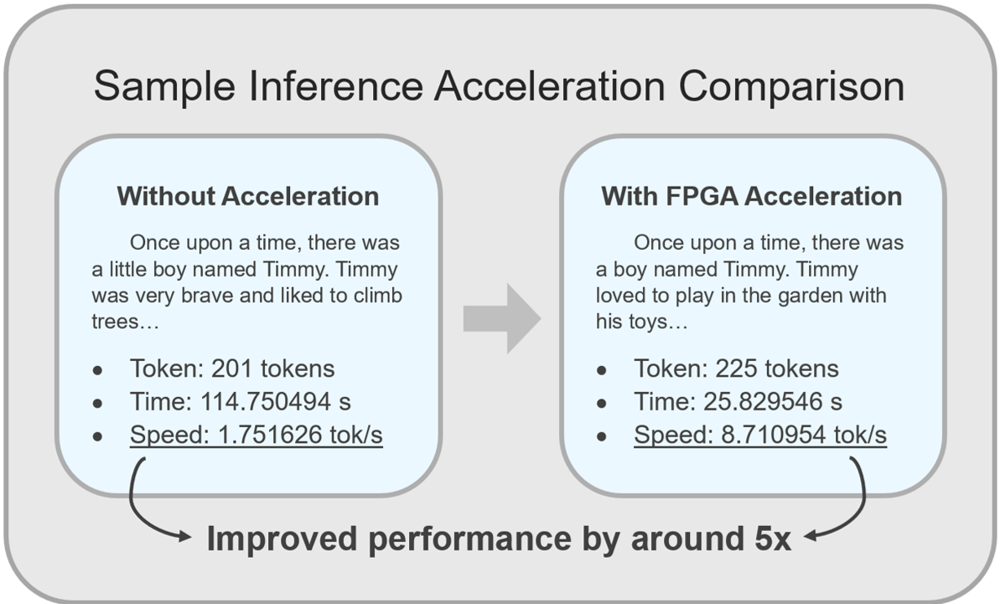
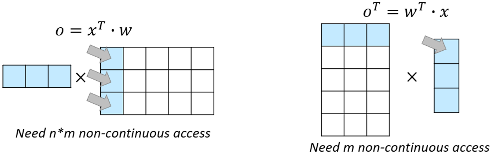
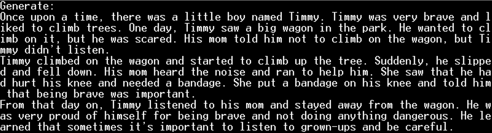

# High-Level Synthesis Based Acceleration of LLaMA2 Inference on FPGA

**學校：** 國立陽明交通大學 資訊工程學系  
**課程：** 資訊工程專題（二）  
**學生：** 趙堉安  
**組員：** 金以凡  
**指導教授：** 陳添福 教授  
**日期：** 中華民國114年07月

## 動機與目的
隨著大型語言模型（Large Language Models, LLMs）在自然語言處理領域的廣泛應用，其推論效能需求逐漸受到重視。由於推論過程高度依賴矩陣運算，雲端 GPU/TPU 雖具強大計算能力，但不適用於嵌入式系統或邊緣裝置的應用場景中。相較之下，現場可程式化閘陣列（Field-Programmable Gate Array, FPGA）不僅能滿足嵌入式系統的資源限制，也能支援邊緣運算的即時需求，因此成為加速語言模型推論的理想方案。

本研究利用高階合成（High-Level Synthesis, HLS）技術，將語言模型推論中計算密集的運算（如矩陣乘法）轉換為硬體描述，並卸載至 FPGA 以提升整體推論速度。以開源專案 llama2.c 為基礎，針對經TinyStories 訓練的輕量級語言模型進行實驗，驗證 FPGA 加速在推論中的可行性與效能提升成果，進而探討其在邊緣 AI 應用的潛力。

## 系統開發與架構
本研究基於開源 llama2.c 開發語言模型推論，採用ZCU106 FPGA開發板作為硬體平台，並利用 Xilinx Vitis HLS 將 C 程式轉換為可執行的硬體邏輯。整體系統架構如圖所示，分為Host Application（載入 Kernel 並傳送模型權重）與Kernel（執行推論運算）兩部分。每層運算包含六種核心操作，本研究對其進行硬體優化，以提升整體推論效能。

## 核心運算模組與加速方法
在LLaMA2推論過程中，六個核心運算模組佔據主要計算資源。本研究針對這些模組利用 HLS pragma 進行陣列切分（Array Partition）、迴圈展開（Loop Unrolling）與流水線設計（Pipeline II=1）設計，提升資料存取與運算的平行度，實現完整管線化（Fully Pipelined）結構，使系統能在每個時脈週期持續處理新輸入，進一步提高整體吞吐量。此外，以下四個模組進行了額外的優化：

### 1. 矩陣乘法（Matrix Multiplication）
雖然矩陣乘法的目標是計算左圖中 x^T∙w 的乘積，但這種運算會產生大量非連續記憶體存取，增加延遲。因此使用右圖的 w^T∙x，有效降低記憶體存取次數，大幅提升計算效率。

### 2. 均方根層歸一化（Root Mean Square Normalization, RMSNorm）
由於RMS計算過程中的 N 為已知常數，因此可預先計算 1/N 的值，以乘法取代原本的除法，簡化計算步驟並提升運算速度。

### 3. 自注意力機制（Self-Attention）
與RMSNorm 相似，自注意力計算中的 d_k 為已知常數，因此可以預先計算 1/d_k  ，並以乘法取代除法及根號運算，以降低硬體運算負擔。

### 4. 旋轉位置編碼（Rotary Position Embedding, RoPE） 
將 embedding table 以及 sin/cos 查表資料預先載入 FPGA 的 BRAM，避免多次從 DRAM 存取，縮短資料傳輸延遲，提升運算速度。

## 實驗成果與分析
本研究以 ZCU106 FPGA 開發板作為硬體平台，驗證 LLaMA2 推論加速效果。為全面評估硬體加速對輕量級語言模型的影響，實驗選用經 TinyStories 訓練的 15M 模型，以簡單的故事生成任務作為測試場景。模型如圖所示，能自動生成完整的故事，呈現模型在故事生成任務中的輸出表現。

實驗結果顯示，執行原始 llama2.c 版本的推論速度約為 1.75 tokens/s，而 FPGA 加速後的推論速度提升至 8.71 tokens/s，約為原始版本的五倍，明顯改善了推論效能，驗證了 FPGA 加速對 LLaMA2 模型推論的有效性。

- [demo 影片](https://youtu.be/TFRW2Q2ucP4)

## 結論
本研究針對 LLaMA2 模型在 FPGA 上的推論進行加速設計與實作。實驗結果顯示，將計算密集的運算卸載至 FPGA Kernel 並進行硬體優化後，推論速度可提升約五倍，顯著改善模型在輕量級任務中的效能表現。然而， FPGA 在硬體資源上仍有限制。例如記憶體容量不足以支援更大模型，運算資源也限制了平行化程度的擴展。

總體而言，本研究驗證了將大型語言模型運行於邊緣裝置的可行性，並提供了針對 FPGA 加速設計的實務參考，為未來在邊緣 AI 系統上部署語言模型提供了可行方向。未來可進一步優化記憶體使用與運算平行化，並結合模型壓縮技術，以支援更大規模的語言模型在 FPGA 上的高效推論。

## 參考資料
- [llama2.c](https://github.com/karpathy/llama2.c/)
- [TinyStories](https://huggingface.co/datasets/roneneldan/TinyStories)
- [swan](https://github.com/turingmotors/swan/)
- [HLSTransform](https://github.com/HLSTransform/submission/)
- [Vitis Tutorial](https://docs.amd.com/r/2024.1-English/Vitis-Tutorials-Vitis-Platform-Creation/)
- [从零开始的Vitis教程](https://www.bilibili.com/video/BV1Fv411q7EK/)
- [從零開始的 Xilinx SoC 開發](https://ys-hayashi.me/2021/08/xilinx-soc-01/)

